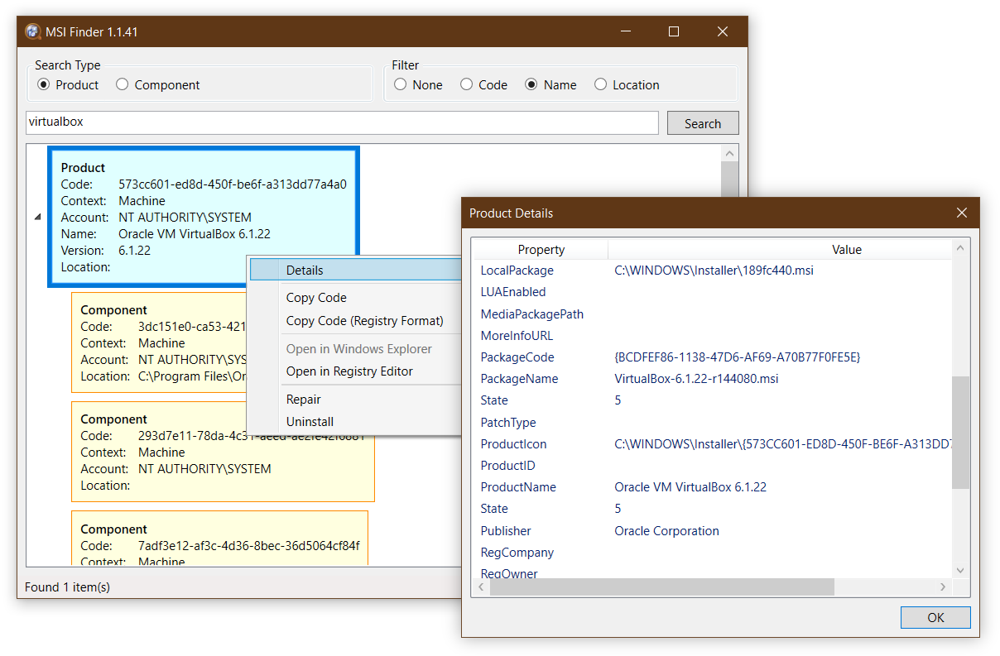

<h1 align="center"> MSI Finder</h1>

MSI finder is a Windows desktop tool for developers and system administrators that lets you easily search for Windows Installer (also known as MSI) [products](https://docs.microsoft.com/en-us/windows/win32/msi/product-codes) and [components](https://docs.microsoft.com/en-us/windows/win32/msi/windows-installer-components) installed on your local PC.

# Download and Usage

Simply get the latest version [here](https://github.com/yariker/MsiFinder/releases), unzip it to a folder, and run `MsiFinder.exe`.
